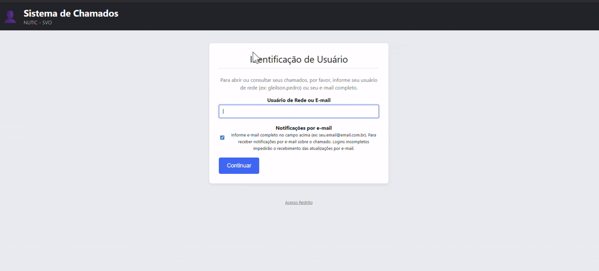

# Sistema de Chamados Interno - TI


Um sistema de help desk completo e funcional, desenvolvido para a gestão de chamados internos do setor de T.I. , otimizado para rodar em um ambiente de servidor local com XAMPP e compatível com versões mais antigas de PHP.

### Demonstração do Sistema
()

---

- [📜 Sobre o Projeto](#-sobre-o-projeto)
- [✨ Features Principais](#-features-principais)
- [🛠️ Tecnologias e Versões](#️-tecnologias-e-versões)
- [📂 Estrutura do Projeto](#-estrutura-do-projeto)
- [🚀 Guia de Instalação e Configuração](#-guia-de-instalação-e-configuração)
- [📖 Como Usar](#-como-usar)
- [📄 Licença](#-licença)

---

## 📜 Sobre o Projeto

Este projeto foi criado para solucionar a necessidade de um controle centralizado e eficiente das solicitações de suporte técnico. Ele substitui métodos informais (como e-mails ou mensagens) por uma plataforma estruturada onde usuários podem abrir, acompanhar e interagir com seus chamados, e o administrador pode gerenciar todo o fluxo de trabalho, desde a abertura até o encerramento e a geração de relatórios de performance.

## ✨ Features Principais

#### ✅ Painel do Usuário
- **Identificação Inteligente:** Página de entrada que solicita usuário de rede ou e-mail, com validação em tempo real para ativar/desativar a opção de notificação.
- **Visualização Dedicada:** O usuário visualiza apenas seus próprios chamados, com separação entre "Em Andamento" e "Encerrados".
- **Criação de Chamados Simplificada:** Formulário para criar novos chamados com título, descrição e anexo de imagens.
- **Atualização em Tempo Real:** A lista de chamados do usuário e a página de detalhes são atualizadas automaticamente via JavaScript (AJAX Polling), com destaque visual para chamados modificados.

#### ✅ Painel do Administrador
- **Login Seguro:** Acesso ao painel protegido por nome de usuário e senha, com senhas armazenadas de forma segura (hash).
- **Dashboard Centralizado:** Visão geral de todos os chamados abertos/pendentes e os já resolvidos.
- **Gestão Completa:** O administrador pode alterar o status de um chamado para "Aberto", "Pendente" ou "Fechado".
- **Comunicação Direta:** Resposta direta ao usuário através de um histórico de mensagens dentro de cada chamado.
- **Atualização em Tempo Real:** Novos chamados aparecem instantaneamente no painel do admin.

#### ✅ Notificações e Relatórios
- **Notificações por E-mail:** Envio automático de e-mails (usando PHPMailer) para o usuário e para o admin na abertura e em cada atualização de um chamado.
- **Relatórios Profissionais:** Página dedicada para gerar relatórios com filtros avançados por Usuário, Máquina (Hostname) e Período (Data).
- **Análise de SLA:** O relatório calcula e exibe o tempo de atendimento (SLA) para cada chamado encerrado, a média geral do período e permite a impressão/salvamento em PDF.

## 🛠️ Tecnologias e Versões

-   **Backend:** **PHP 5.6+** (O código foi refatorado para garantir máxima compatibilidade).
-   **Frontend:** HTML5, CSS3, JavaScript (Vanilla JS).
-   **Banco de Dados:** **MariaDB 10.1+** / **MySQL 5.6+**.
-   **Servidor de E-mail:** Biblioteca **PHPMailer**.
-   **Ambiente:** Projetado e testado em servidor **Apache** via **XAMPP**.

## 📂 Estrutura do Projeto
```
/suporte/
|-- /css/
|   |-- style.css
|   |-- relatorios.css
|-- /PHPMailer/
|   |-- /src/
|       |-- Exception.php
|       |-- PHPMailer.php
|       |-- SMTP.php
|-- /uploads/
|   |-- .gitkeep (para manter a pasta no Git)
|-- .gitignore
|-- api_updates.php
|-- config.php.example (Arquivo de exemplo)
|-- criar_admin.php (Script de uso único para criar admin)
|-- index.php
|-- login_admin.php
|-- login_process.php
|-- logout.php
|-- novo_chamado.php
|-- painel_admin.php
|-- painel_usuario.php
|-- README.md
|-- relatorios.php
|-- salvar_chamado.php
|-- salvar_interacao.php
|-- ver_chamado.php
```

## 🚀 Guia de Instalação e Configuração

#### 1. Pré-requisitos
-   Ter o **XAMPP** instalado (com PHP 5.6+, Apache e MariaDB).

#### 2. Instalação
1.  **Baixe os Arquivos:** Clone ou baixe o ZIP deste repositório.
2.  **Posicione os Arquivos:** Mova a pasta do projeto para `C:\xampp\htdocs\suporte`.
3.  **Inicie os Serviços:** Inicie os serviços **Apache** e **MySQL** no XAMPP.
4.  **Banco de Dados:**
    -   Acesse `http://localhost/phpmyadmin`.
    -   Crie um novo banco de dados chamado `nutic_chamados`.
    -   Selecione o banco e vá para a aba **"SQL"**.
    -   Copie e execute o script SQL completo fornecido no SQL.txt.
5.  **Configuração Segura (MUITO IMPORTANTE):**
    -   Na pasta do projeto, encontre o arquivo `config.php.example`.
    -   Faça uma cópia dele e renomeie para `config.php`.
    -   Abra o novo `config.php` e preencha suas credenciais do banco de dados (geralmente as padrão do XAMPP já funcionam) e do seu servidor de e-mail (SMTP).
    -   O arquivo `.gitignore` já está configurado para **NUNCA** enviar o seu `config.php` com senhas para o GitHub.
6.  **Criar Usuário Admin:**
    -   Edite o arquivo `criar_admin.php`, definindo seu nome de usuário e senha desejados.
    -   Acesse `http://localhost/suporte/criar_admin.php` no navegador.
    -   Copie o *hash* da senha gerado.
    -   No `phpMyAdmin`, vá na tabela `administradores`, clique em "Inserir", e cole o `username` e o `password_hash`.
    -   **DELETE o arquivo `criar_admin.php` por segurança.**

## 📖 Como Usar

-   **Acesso do Usuário:** `http://localhost/suporte/`
-   **Acesso do Administrador:** `http://localhost/suporte/login_admin.php` (ou pelo link "Acesso Restrito" na página inicial).

---
Desenvolvido por **Gleilson Pedro**.
